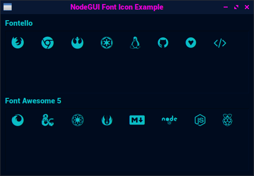

# NodeGui Icon Font Example

This is a example of how to use a icon font, such as [Fontello](http://fontello.com/), [Font Awesome](https://fontawesome.com), etc, on your NodeGui proyects.

### Run example:

* Download or clone this repo.
* Open a terminal in the proyect folder and run `npm i`
* To execute the example run `npm start`

Documentation in progress....